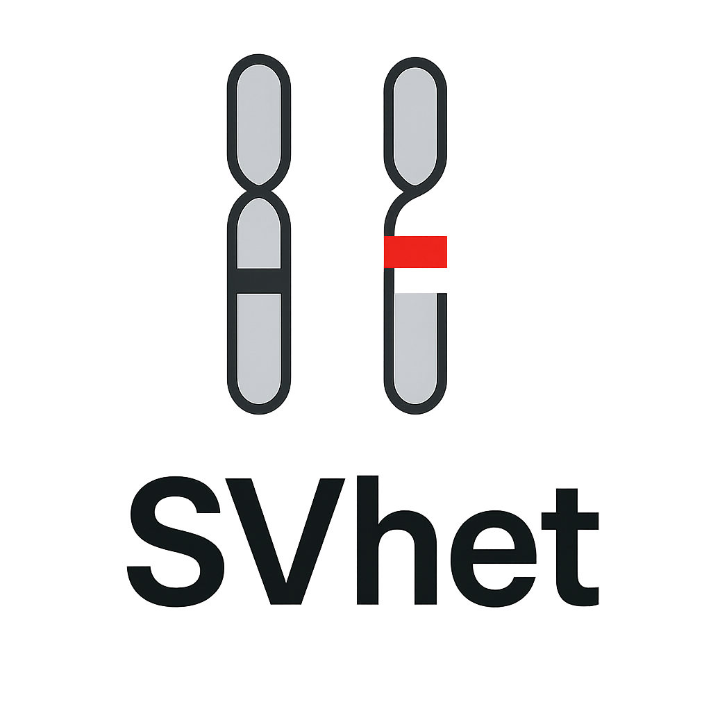

<p align="center">
   
</p>


# SVhet: Structural Variant Filtering using Heterozygosity

SVhet is a pipeline for filtering **heterozygous deletion** calls in cohort-level VCFs using evidence from heterozygous sites in short-read sequencing data. It improves the reliability of heterozygous deletion calls by leveraging read-level and variant-level information across samples. SVhet does not filter other types of structural variants.

---

## Table of Contents

1. [Features](#features)
2. [Installation & Dependencies](#installation--dependencies)
3. [Usage](#usage)
4. [Pipeline Overview](#pipeline-overview)
5. [Output Format](#output-format)
6. [Example Files & Run](#example-files--run)
7. [Citation](#citation)
8. [Contact](#contact)

---

## Features

- Filters **heterozygous deletions** based on genotype and quality metrics
- Per-sample read evidence extraction for wild-type (WT) and mutant (MUT) alleles
- Short variant calling on extracted read sets
- Heterozygosity evaluation within deletion regions and their flanking regions to flag unreliable calls
- Produces a single, annotated cohort-level VCF for downstream analysis

---

## Installation & Dependencies

- [bcftools](http://samtools.github.io/bcftools/)
- [bedtools](https://bedtools.readthedocs.io/)
- [pysam](https://pysam.readthedocs.io/)
- Python 3.6+
- numpy, tqdm

---

## Usage

```bash
bash svhet.sh --ref <reference.fasta> \
              --sv-vcf <cohort.vcf.gz> \
              --outdir <output_dir> \
              --manifest <manifest.txt> \
              [--bed <regions.bed>] [--jobs <N>] [--keep-intermediate] [--min-dp <N>] [--high-het <N>]
```


**Required Arguments**
- `--ref` : Reference FASTA file
- `--sv-vcf` : Cohort-level SV VCF file (bgzipped and indexed)
- `--outdir` : Output directory
- `--manifest` : Tab-delimited file with sample ID (required), BAM path (required), and BAI path per line (optional)

**Optional Arguments**
- `--bed` : BED file of target regions
- `--jobs` : Number of parallel jobs (default: 1)
- `--keep-intermediate` : Keep intermediate files
- `--min-dp` : Minimum depth for reliable HETs (default: 5)
- `--high-het` : Minimum HET count to reject a DEL (default: 1)

---


---

## Pipeline Overview

The main entry point is `svhet.sh`, which orchestrates the following steps:

1. **Generate SV Candidates** (`01_generate_candidates.sh`)
   - Filters cohort VCF for deletion candidates with at least one heterozygous carrier.
   - Splits candidates by SV length (default: <1e6 and >1e6) and applies additional quality filters.
   - Optionally restricts to target regions using a BED file.

2. **Extract Per-Sample Read Evidence** (`02_filter_by_samples.py`)
   - For each sample and candidate, extracts WT and MUT supporting reads from the BAM file.
   - Writes these reads to temporary BAMs for downstream variant calling.
   - Handles both small and large SV candidates.

3. **Short Variant Calling** (`03_call_variants.sh`)
   - Calls short variants (SNPs/indels) on the WT and MUT BAMs using `bcftools mpileup` and `bcftools call`.
   - Filters for heterozygous sites.

4. **Heterozygosity Evaluation** (`04_het_evaluator.py`)
   - Compares the number of reliable heterozygous sites in WT and MUT callsets within each SV region.
   - Annotates the candidate VCF with the number of HETs and a filter status (PASS or HIGH_HET).
   - All sample-level VCFs are merged into a final, cohort-level annotated VCF.

---

## Output Format

After running the pipeline, a single bgzipped, annotated cohort-level VCF (VCFv4.2 format) is created (`final-annotated.vcf.gz`). This file contains SVhet-specific annotations for downstream filtering and interpretation.

### SVhet-specific FORMAT annotations

- `SVHET`
   - `PASS`: Variant passes SVhet filtering
   - `HIGH_HET`: Variant flagged due to high heterozygosity in the region
- `WT_HETS`: Number of reliable heterozygous sites in the wild-type (WT) allele region (per sample)
- `MUT_HETS`: Number of reliable heterozygous sites in the mutant (MUT) allele region (per sample)

### Minimal Example Output

```
#CHROM	POS	ID	REF	ALT	QUAL	FILTER	INFO	FORMAT	SAMPLE1	SAMPLE2
chr1	123456	sv1	N	<DEL>	60	PASS	.	GT:WT_HETS:MUT_HETS:SVHET	0/1:3:0:PASS	0/0:0:0:PASS
chr2	234567	sv2	N	<DEL>	50	PASS	.	GT:WT_HETS:MUT_HETS:SVHET	0/1:5:2:HIGH_HET	0/1:4:0:PASS
```

In the example above, `sv2` should be excluded from downstream analysis due to high heterozygosity detected from WT and MUT read evidences. For true heterozygous deletions, `WT_HETS` and `MUT_HETS` are typically 0 since only one haplotype exists in the deleted region. Currently, SVhet flags heterozygous deletions with >1 heterozygous site as `HIGH_HET`.

---

## Example Files & Run

**Example Manifest File**
```
HG00096  /path/to/HG00096.bam /path/to/HG00096.bam.bai
HG00097  /path/to/HG00097.bam /path/to/HG00097.bam.bai
```

**Example Run**
```bash
bash svhet.sh --ref chm13.v2.fasta \
             --sv-vcf lumpy.vcf.gz \
             --outdir results/ \
             --manifest manifest.txt \
             --jobs 4
```

---

## Citation

If you use SVhet in your research, please cite:

> CH She, et al. SVhet: Heterozygosity-based filtering of structural variant calls in cohorts. (2025)

---

## Contact

For questions or issues, please contact Louis (snakesch@connect.hku.hk).
